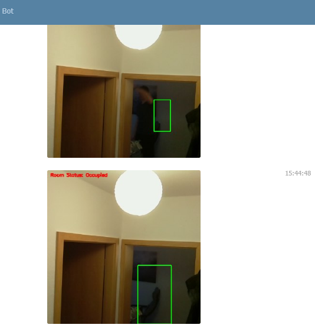

### SurvBot
This programm monitors a video feed and notifies the user via a telegram bot if motion has been detected.  
It can be enabled/disabled via chat commands ("/start", "/stop") 

#### Requirements:
- video feed
- server 
- telegram bot
- tls endpoint

#### Start
- rename img to imgs
- rename data1.json to data.json
- insert token + key into data.json
- change config.py to your requirements
- pip install -r requirements.txt
- python app.py

#### Result:

