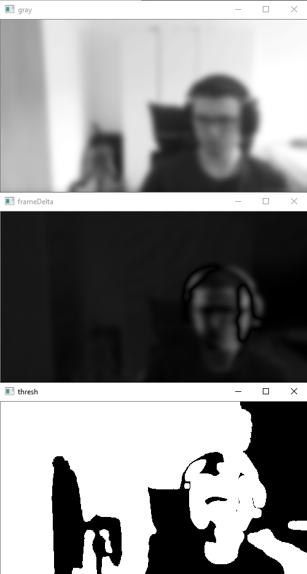

### SurvBot
This programm monitors a video feed and notifies the user via a telegram bot if motion has been detected.  
It can be enabled/disabled via chat commands ("/start", "/stop") 

#### Requirements:
- video feed
- server 
- telegram bot
- tls endpoint (optional)

#### Quick Start
- insert bot-token + chat-key into config.py
- change config.py to your requirements
- pip install -r requirements.txt
- python app.py

#### Docker Deployment
    docker build -t survbot .
    docker run -d --rm -p 80:5003 survbot

#### Result:

#### How it works

The image is scaled down and blured, then the difference to an earlier frame is calculated.  
The resulting frame is binarized. Then all contours are marked if they contain a number of changed pixels between the upper and lower bound specified in config.py.  

Those contours are then marked in the original image, which is then saved in the filesystem and sent to the specified telegram bot. 

